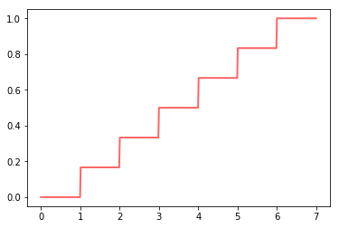

<p align="left">

<i>An open source project from Data to AI Lab at MIT.</i>
</p>

[![][pypi-img]][pypi-url]
[![][travis-img]][travis-url]

[travis-img]: https://travis-ci.org/DAI-Lab/Copulas.svg?branch=master
[travis-url]: https://travis-ci.org/DAI-Lab/Copulas
[pypi-img]: https://img.shields.io/pypi/v/copulas.svg
[pypi-url]: https://pypi.python.org/pypi/copulas

# Copulas

A python library for building multivariate distributuions with [copulas](https://en.wikipedia.org/wiki/Copula_(probability_theory)) and using them for sampling.

* Free software: MIT license
* Documentation: [https://DAI-Lab.github.io/Copulas](https://DAI-Lab.github.io/Copulas)

# Overview

This repository contains multiple implementations of bivariate and multivariate copulas, 

* Most usual statistical functions from the underlying distribution.
* Built-in inverse-transform sampling method.
* Easy save and load of fitted copulas.
* Create copulas directly from their parameters.

## Data Format

This package works under the assumption that the data is perfectly clean, that means that:

* Has no missing or invalid values.
* Has columns of types `int` or `float`.

## Concepts

### Probability

We call **probability** to the measure assigned to the change of an event happe

### Distribution

A **distribution** is a mathematical object that describes the behavior of a random phenomenon,
like rolling a dice, and the probability of events related to them.

Usually a distribution is presented as a function f: ℝ -> [0, 1], called the **cumulative distribution function**
 or **cdf**, that has the following properties:

* Is strictly **non-decreasing**
* Is **right-continous**
* It's negative infinite limit exists and is 0.
* It's positive infinite limit exists and is 1.

Below we can see the cdf of the distribution of rolling a standard, 6 sided, dice:



We can see as the cumulative probability raises by steps of 1/6 at each integer between 1 and 6,
as those are the only values that can appear 

### Types of distributions

There are as many different distributions as different random phenomenon, 


### Multivariate distributions

### Copulas 

Copu

## Supported Copulas

### Bivariate copulas

* Clayton
* Frank
* Gumbel
* Independence

### Multivariate

* Gaussian [[+ info]](https://en.wikipedia.org/wiki/Copula_(probability_theory)#Gaussian_copula)
* Vines

# Getting started

## Installation

The simplest and recommended way to install **Copulas** is using `pip`

```
pip install copulas
```

For development, you can also clone the repository and install it from sources

```
git clone git@github.com:DAI-Lab/Copulas.git
cd Copulas
python setup.py install
```

## Usage

Below there is a short example about how to use Copulas to create a gaussian copula, fit it using
demo data and use it to generate samples.

For advance usage and more detailed explanation about each component, please have a look at the
documentation.

**NOTE:** To be able to run this demo you will need to install the package from its sources.

### Creating a gaussian copula

To create a gaussian copula in Copula you only need to call the GaussianMultivariate class.
This will create a new instance with the default parameters.

```python
>>> from copulas.multivariate import GaussianMultivariate
>>> gm = GaussianMultivariate()
```

Now we will load a demo dataset and use it to fit our copula

```python
>>> import pandas as pd
>>> data = pd.read_csv('data/iris.data.csv')
>>> gc.fit(data)
```

Now we are ready to use the copula, let's start by sampling some data:

```python
samples = gm.sample(1000)

```


When you have a numeric data table, you can also create a copula and use it to sample from
the multivariate distribution. In this example, we will use a Gaussian Copula.

```python
>>> from copulas.multivariate.gaussian import GaussianMultivariate
>>> gc = GaussianMultivariate()
```

At this point our gaussian copula has no parameters, so 


```
>>> gc.fit(data)
>>> print(gc)
feature_01
===============
Distribution Type: Gaussian
Variable name: feature_01
Mean: 5.843333333333334
Standard deviation: 0.8253012917851409

feature_02
===============
Distribution Type: Gaussian
Variable name: feature_02
Mean: 3.0540000000000003
Standard deviation: 0.4321465800705435

feature_03
===============
Distribution Type: Gaussian
Variable name: feature_03
Mean: 3.758666666666666
Standard deviation: 1.7585291834055212

feature_04
===============
Distribution Type: Gaussian
Variable name: feature_04
Mean: 1.1986666666666668
Standard deviation: 0.7606126185881716

Covariance matrix:
[[ 1.26935536  0.64987728  0.94166734 ... -0.57458312 -0.14548004
  -0.43589371]
 [ 0.64987728  0.33302068  0.4849735  ... -0.29401609 -0.06772633
  -0.21867228]
 [ 0.94166734  0.4849735   0.72674568 ... -0.42778472 -0.04608618
  -0.27836438]
 ...
 [-0.57458312 -0.29401609 -0.42778472 ...  0.2708685   0.0786054
   0.19208669]
 [-0.14548004 -0.06772633 -0.04608618 ...  0.0786054   0.17668562
   0.14455133]
 [-0.43589371 -0.21867228 -0.27836438 ...  0.19208669  0.14455133
   0.22229033]]
```

Once you have fit the copula, you can sample from it.

```python
gc.sample(5)
   feature_01  feature_02  feature_03  feature_04
0    5.529610    2.966947    3.162891    0.974260
1    5.708827    3.011078    3.407812    1.149803
2    4.623795    2.712284    1.283194    0.213796
3    5.952688    3.086259    4.088219    1.382523
4    5.360256    2.920929    2.844729    0.826919
```
