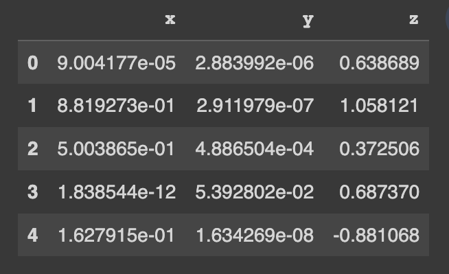

<div align="center">
<br/>
<p align="center">
    <i>This repository is part of <a href="https://sdv.dev">The Synthetic Data Vault Project</a>, a project from <a href="https://datacebo.com">DataCebo</a>.</i>
</p>

[](https://pypi.org/search/?c=Development+Status+%3A%3A+2+-+Pre-Alpha)
[](https://pypi.python.org/pypi/copulas)
[](https://pepy.tech/project/copulas)
[](https://github.com/sdv-dev/Copulas/actions/workflows/unit.yml)
[](https://codecov.io/gh/sdv-dev/Copulas)
[](https://bit.ly/sdv-slack-invite)

<div align="left">
<br/>
<p align="center">
<a href="https://github.com/sdv-dev/Copulas">
</img>
</a>
</p>
</div>

</div>

# Overview

**Copulas** is a Python library for modeling multivariate distributions and sampling from them
using copula functions.
Given a table of numerical data, use Copulas to learn the distribution and
generate new synthetic data following the same statistical properties.

**Key Features:**

* **Model multivariate data.** Choose from a variety of univariate
distributions and copulas – including Archimedian Copulas, Gaussian Copulas and Vine Copulas.

* **Compare real and synthetic data visually** after building your model. Visualizations
are available as 1D histograms, 2D scatterplots and 3D scatterplots.

* **Access & manipulate learned parameters.** With complete access to the internals
of the model, set or tune parameters to your choosing.

# Install

Install the Copulas library using pip or conda.

```bash
pip install copulas
```

```bash
conda install -c conda-forge copulas
```

# Usage

Get started using a demo dataset. This dataset contains 3 numerical columns.

```python
from copulas.datasets import sample_trivariate_xyz

real_data = sample_trivariate_xyz()
real_data.head()
```



Model the data using a copula and use it to create synthetic data.
The Copulas library offers many options including Gaussian Copula,
Vine Copulas and Archimedian Copulas.

```python
from copulas.multivariate import GaussianMultivariate

copula = GaussianMultivariate()
copula.fit(real_data)

synthetic_data = copula.sample(len(real_data))
```

Visualize the real and synthetic data side-by-side. Let's do this in 3D so see our full dataset.

```python
from copulas.visualization import compare_3d

compare_3d(real_data, synthetic_data)
```


# Tutorials
Click below to run the code yourself on a Colab Notebook and discover new features.

[](https://bit.ly/copulas-demo)

# Community & Support

Learn more about Copulas library from our [documentation](https://sdv.dev/Copulas/) site.

**Questions or issues?** Join our [Slack channel](https://bit.ly/sdv-slack-invite)
to discuss more about Copulas and synthetic data.
If you find a bug or have a feature request, you can also
[open an issue](https://github.com/sdv-dev/Copulas/issues/new/choose) on our GitHub.

**Interested in contributing to Copulas?** Read our
[Contribution Guide](https://sdv.dev/Copulas/contributing.html) to get started.

# Credits

The Copulas open source project first started at the Data to AI Lab at MIT in 2018.
Thank you to our team of contributors who have built and maintained the library over the years!

[View Contributors](https://github.com/sdv-dev/Copulas/graphs/contributors)

---


<div align="center">
<a href="https://datacebo.com"></img></a>
</div>
<br/>
<br/>

[The Synthetic Data Vault Project](https://sdv.dev) was first created at MIT's [Data to AI Lab](
https://dai.lids.mit.edu/) in 2016. After 4 years of research and traction with enterprise, we
created [DataCebo](https://datacebo.com) in 2020 with the goal of growing the project.
Today, DataCebo is the proud developer of SDV, the largest ecosystem for
synthetic data generation & evaluation. It is home to multiple libraries that support synthetic
data, including:

* 🔄 Data discovery & transformation. Reverse the transforms to reproduce realistic data.
* 🧠 Multiple machine learning models -- ranging from Copulas to Deep Learning -- to create tabular,
  multi table and time series data.
* 📊 Measuring quality and privacy of synthetic data, and comparing different synthetic data
  generation models.

[Get started using the SDV package](https://sdv.dev/SDV/getting_started/install.html) -- a fully
integrated solution and your one-stop shop for synthetic data. Or, use the standalone libraries
for specific needs.
