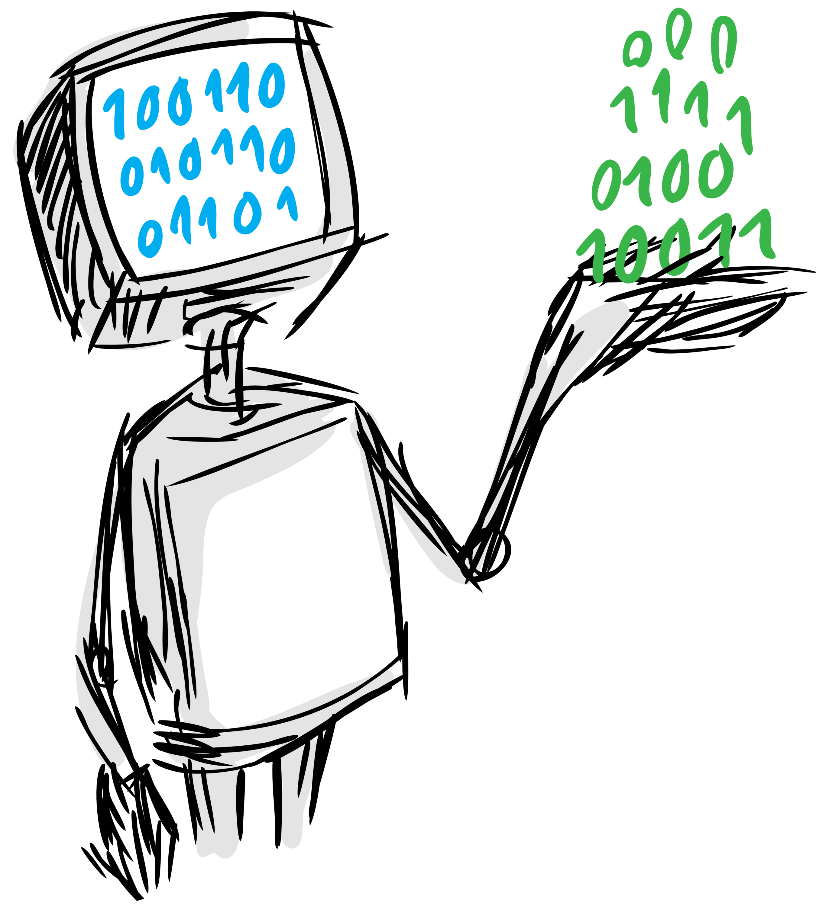

<p align="left">
  <a href="https://dai.lids.mit.edu">
    
  </a>
  <i>An Open Source Project from the <a href="https://dai.lids.mit.edu">Data to AI Lab, at MIT</a></i>
</p>

[](https://pypi.org/search/?c=Development+Status+%3A%3A+2+-+Pre-Alpha)
[](https://pypi.python.org/pypi/copulas)
[](https://pepy.tech/project/copulas)
[](https://github.com/sdv-dev/Copulas/actions?query=workflow%3A%22Run+Tests%22+branch%3Amaster)
[](https://codecov.io/gh/sdv-dev/Copulas)


# Overview

* Website: https://sdv.dev
* Documentation: https://sdv.dev/Copulas
* Repository: https://github.com/sdv-dev/Copulas
* License: [MIT](https://github.com/sdv-dev/Copulas/blob/master/LICENSE)
* Development Status: [Pre-Alpha](https://pypi.org/search/?c=Development+Status+%3A%3A+2+-+Pre-Alpha)

**Copulas** is a Python library for modeling multivariate distributions and sampling from them
using [copula functions](https://en.wikipedia.org/wiki/Copula_%28probability_theory%29).
Given a table containing numerical data, we can use Copulas to learn the distribution and
later on generate new synthetic rows following the same statistical properties.

Some of the features provided by this library include:

* A variety of distributions for modeling univariate data.
* Multiple Archimedean copulas for modeling bivariate data.
* Gaussian and Vine copulas for modeling multivariate data.
* Automatic selection of univariate distributions and bivariate copulas.

## Supported Distributions

### Univariate

* Beta
* Gamma
* Gaussian
* Gaussian KDE
* Log-Laplace
* Student T
* Truncated Gaussian
* Uniform

### Archimedean Copulas (Bivariate)

* Clayton
* Frank
* Gumbel

### Multivariate

* Gaussian Copula
* D-Vine
* C-Vine
* R-Vine

# Install

## Requirements

**Copulas** is part of the **SDV** project and is automatically installed alongside it. For
details about this process please visit the [SDV Installation Guide](
https://sdv.dev/SDV/getting_started/install.html)

Optionally, **Copulas** can also be installed as a standalone library using the following commands:

**Using `pip`:**

```bash
pip install copulas
```

**Using `conda`:**

```bash
conda install -c sdv-dev -c conda-forge copulas
```

For more installation options please visit the [Copulas installation Guide](INSTALL.md)

# Quickstart

In this short quickstart, we show how to model a multivariate dataset and then generate
synthetic data that resembles it.

```python3
import warnings
warnings.filterwarnings('ignore')

from copulas.datasets import sample_trivariate_xyz
from copulas.multivariate import GaussianMultivariate
from copulas.visualization import compare_3d

# Load a dataset with 3 columns that are not independent
real_data = sample_trivariate_xyz()

# Fit a gaussian copula to the data
copula = GaussianMultivariate()
copula.fit(real_data)

# Sample synthetic data
synthetic_data = copula.sample(len(real_data))

# Plot the real and the synthetic data to compare
compare_3d(real_data, synthetic_data)
```

The output will be a figure with two plots, showing what both the real and the synthetic
data that you just generated look like:


# What's next?

For more details about **Copulas** and all its possibilities and features, please check the
[documentation site](https://sdv.dev/Copulas/).

There you can learn more about [how to contribute to Copulas](https://sdv.dev/Copulas/contributing.html)
in order to help us developing new features or cool ideas.

# Credits

Copulas is an open source project from the Data to AI Lab at MIT which has been built and
maintained over the years by the following team:

* Manuel Alvarez <manuel@pythiac.com>
* Carles Sala <csala@mit.edu>
* (Alicia) Yi Sun <yis@mit.edu>
* José David Pérez <jose@pythiac.com>
* Kevin Alex Zhang <kevz@mit.edu>
* Andrew Montanez <amontane@mit.edu>
* Gabriele Bonomi <gbonomib@gmail.com>
* Kalyan Veeramachaneni <kalyan@csail.mit.edu>
* Iván Ramírez <rollervan@gmail.com>
* Felipe Alex Hofmann <fealho@gmail.com>
* paulolimac <paulolimac@gmail.com>
* nazar-ivantsiv <nazar.ivantsiv@gmail.com>

# The Synthetic Data Vault

<p>
  <a href="https://sdv.dev">
    
  </a>
  <p><i>This repository is part of <a href="https://sdv.dev">The Synthetic Data Vault Project</a></i></p>
</p>

* Website: https://sdv.dev
* Documentation: https://sdv.dev/SDV
