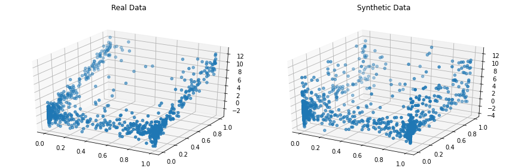

<p align="left">

<i>An open source project from Data to AI Lab at MIT.</i>
</p>

[](https://pypi.org/search/?c=Development+Status+%3A%3A+2+-+Pre-Alpha)
[](https://pypi.python.org/pypi/copulas)
[](https://travis-ci.org/sdv-dev/Copulas)
[](https://codecov.io/gh/sdv-dev/Copulas)
[](https://pepy.tech/project/copulas)

# Copulas

* License: [MIT](https://github.com/sdv-dev/Copulas/blob/master/LICENSE)
* Development Status: [Pre-Alpha](https://pypi.org/search/?c=Development+Status+%3A%3A+2+-+Pre-Alpha)
* Documentation: https://sdv-dev.github.io/Copulas
* Homepage: https://github.com/sdv-dev/Copulas

# Overview

**Copulas** is a Python library for modeling multivariate distributions and sampling from them
using [copula functions](https://en.wikipedia.org/wiki/Copula_%28probability_theory%29).
Given a table containing numerical data, we can use Copulas to learn the distribution and
later on generate new synthetic rows following the same statistical properties.

Some of the features provided by this library include:

* A variety of distributions for modeling univariate data.
* Multiple Archimedean copulas for modeling bivariate data.
* Gaussian and Vine copulas for modeling multivariate data.
* Automatic selection of univariate distributions and bivariate copulas.

## Supported Distributions

### Univariate

* Gaussian
* Student T
* Beta
* Gamma
* Gaussian KDE
* Truncated Gaussian

### Archimedean Copulas (Bivariate)

* Clayton
* Frank
* Gumbel

### Multivariate

* Gaussian
* D-Vine
* C-Vine
* R-Vine

# Install

## Requirements

**Copulas** has been developed and tested on [Python 3.5, 3.6 and 3.7](https://www.python.org/downloads/)

Also, although it is not strictly required, the usage of a [virtualenv](https://virtualenv.pypa.io/en/latest/)
is highly recommended in order to avoid interfering with other software installed in the system where **Copulas**
is run.

## Install with pip

The easiest and recommended way to install **Copulas** is using [pip](https://pip.pypa.io/en/stable/):

```bash
pip install copulas
```

This will pull and install the latest stable release from [PyPi](https://pypi.org/).

If you want to install from source or contribute to the project please read the
[Contributing Guide](https://sdv-dev.github.io/Copulas/contributing.html#get-started).

## Install with conda

**Copulas** can also be installed using [conda](https://docs.conda.io/en/latest/):

```bash
conda install -c sdv-dev -c conda-forge copulas
```

This will pull and install the latest stable release from [Anaconda](https://anaconda.org/).


# Quickstart

In this short quickstart, we show how to model a multivariate dataset and then generate
synthetic data that resembles it.

```python3
import warnings
warnings.filterwarnings('ignore')

from copulas.datasets import sample_trivariate_xyz
from copulas.multivariate import GaussianMultivariate
from copulas.visualization import compare_3d

# Load a dataset with 3 columns that are not independent
real_data = sample_trivariate_xyz()

# Fit a gaussian copula to the data
copula = GaussianMultivariate()
copula.fit(real_data)

# Sample synthetic data
synthetic_data = copula.sample(len(real_data))

# Plot the real and the synthetic data to compare
compare_3d(real_data, synthetic_data)
```

The output will be a figure with two plots, showing what both the real and the synthetic
data that you just generated look like:




# What's next?

For more details about **Copulas** and all its possibilities and features, please check the
[documentation site](https://sdv-dev.github.io/Copulas/).

There you can learn more about [how to contribute to Copulas](https://sdv-dev.github.io/Copulas/contributing.html)
in order to help us developing new features or cool ideas.

# Credits

Copulas is an open source project from the Data to AI Lab at MIT which has been built and maintained
over the years by the following team:

* Manuel Alvarez <manuel@pythiac.com>
* Carles Sala <carles@pythiac.com>
* José David Pérez <jose@pythiac.com>
* (Alicia)Yi Sun <yis@mit.edu>
* Andrew Montanez <amontane@mit.edu>
* Kalyan Veeramachaneni <kalyan@csail.mit.edu>
* paulolimac <paulolimac@gmail.com>
* Kevin Alex Zhang <kevz@mit.edu>
* Gabriele Bonomi <gbonomib@gmail.com>

# Related Projects

## SDV

[SDV](https://github.com/HDI-Project/SDV), for Synthetic Data Vault, is the end-user library for
synthesizing data in development under the [HDI Project](https://hdi-dai.lids.mit.edu/).
SDV allows you to easily model and sample relational datasets using Copulas thought a simple API.
Other features include anonymization of Personal Identifiable Information (PII) and preserving
relational integrity on sampled records.

## CTGAN

[CTGAN](https://github.com/sdv-dev/CTGAN) is a GAN based model for synthesizing tabular data.
It's also developed by the [MIT's Data to AI Lab](https://sdv-dev.github.io/) and is under
active development.
