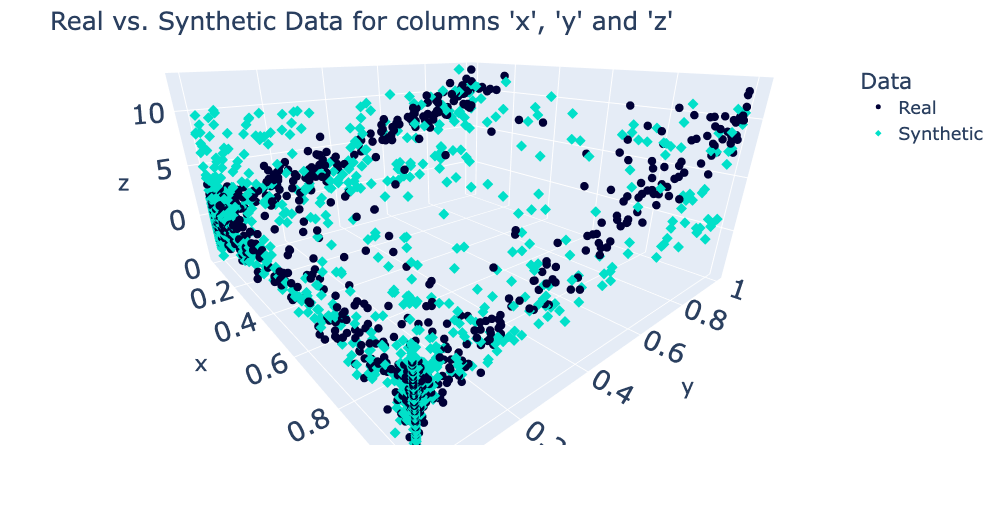

<div align="center">
<br/>
<p align="center">
    <i>This repository is part of <a href="https://sdv.dev">The Synthetic Data Vault Project</a>, a project from <a href="https://datacebo.com">DataCebo</a>.</i>
</p>

[](https://pypi.org/search/?c=Development+Status+%3A%3A+2+-+Pre-Alpha)
[](https://pypi.python.org/pypi/copulas)
[](https://pepy.tech/project/copulas)
[](https://github.com/sdv-dev/Copulas/actions/workflows/unit.yml)
[](https://codecov.io/gh/sdv-dev/Copulas)

<div align="left">
<br/>
<p align="center">
<a href="https://github.com/sdv-dev/Copulas">
</img>
</a>
</p>
</div>

</div>

# Overview

**Copulas** is a Python library for modeling multivariate distributions and sampling from them
using [copula functions](https://en.wikipedia.org/wiki/Copula_%28probability_theory%29).
Given a table containing numerical data, we can use Copulas to learn the distribution and
generate new synthetic data following the same statistical properties.

| Important Links                                   |                                                                      |
| --------------------------------------------- | -------------------------------------------------------------------- |
| :computer: **[Website]**                          | Check out the SDV Website for more information about the project.    |
| :orange_book: **[Blog]**                          | A deeper look at open source, synthetic data creation and evaluation.|
| :book: **[Documentation]**                        | Quickstarts, User and Development Guides, and API Reference.         |
| :octocat: **[Repository]**                        | The link to the Github Repository of this library.                   |
| :scroll: **[License]**                            | The library is published under the MIT License.                      |
| :keyboard: **[Development Status]**               | This software is in its Pre-Alpha stage.                             |
| [![][Slack Logo] **Community**][Community]        | Join our Slack Workspace for announcements and discussions.          |
| [![][Google Colab Logo] **Tutorials**][Tutorials] | Get started with SDMetrics in a notebook.                            |

[Website]: https://sdv.dev
[Blog]: https://datacebo.com/blog
[Documentation]: https://sdv.dev/Copulas/
[Repository]: https://github.com/sdv-dev/Copulas
[License]: https://github.com/sdv-dev/Copulas/blob/master/LICENSE
[Development Status]: https://pypi.org/search/?c=Development+Status+%3A%3A+2+-+Pre-Alpha
[Slack Logo]: https://github.com/sdv-dev/SDV/blob/master/docs/images/slack.png
[Community]: https://bit.ly/sdv-slack-invite
[Google Colab Logo]: https://github.com/sdv-dev/SDV/blob/master/docs/images/google_colab.png
[Tutorials]: https://bit.ly/copulas-demo

# Features

The Copulas library includes a variety of features for modeling multivariate data and using it to sample synthetic data. Key features include:

* **Modeling univariate, bivariate and multivariate data.** Choose from a variety of univariate
distributions and copulas – including Archimedian Copulas, Gaussian Copulas and Vine Copulas.
The library includes tools to automatically select the best distribution for accurate modeling.

* **Comparing real and synthetic data visually** after building your model. Visualizations
are available as 1D histograms, 2D scatterplots and 3D scatterplots.

* **Accessing & manipulating learned parameters.** With complete access to the internals
of the model, advanced users can set or tune parameters to their choosing.

## Supported Distributions
| Distribution Type          | Supported Distributions                                                                  |
| -------------------------- | ---------------------------------------------------------------------------------------- |
| Univariate Distributions   | Beta, Gamma, Gaussian, Gaussian KDE, Log-Laplace, Student T, Truncated Gaussian, Uniform |
| Bivariate Distributions    | Archimedian Copulas: Clayton, Frank, Gumbel                                              |
| Multivariate Distributions | Gaussian Copula, Vine Copulas: D-Vine, C-Vine, R-Vine                                    |
# Install

Install Copulas to use as a standalone library:

**Using `pip`:**

```bash
pip install copulas
```

**Using `conda`:**

```bash
conda install -c conda-forge copulas
```

For more installation options please visit the [Copulas installation Guide](INSTALL.md)

:warning: If you'd like to create synthetic data end-to-end, we recommend getting started with
the **SDV library** which provides user-friendly APIs for Copulas modeling. :warning:

The SDV library provides wrappers for preprocessing your data as well as additional usability features like constraints. See the [SDV documentation](https://bit.ly/sdv-docs) to get started.

# Usage

In this example, we'll load a dataset with 3 columns and model it using a multivariate,
Gaussian Copula.

```python3
from copulas.datasets import sample_trivariate_xyz
from copulas.multivariate import GaussianMultivariate
from copulas.visualization import compare_3d

# Load a dataset with 3 columns
real_data = sample_trivariate_xyz()

# Fit a gaussian copula to the data
copula = GaussianMultivariate()
copula.fit(real_data)

# Sample synthetic data
synthetic_data = copula.sample(len(real_data))

# Plot the real and the synthetic data to compare
compare_3d(real_data, synthetic_data)
```

The output will be a figure with two plots, showing both the real and the synthetic side-by-side.




For more details about **Copulas**, see the [documentation](https://sdv.dev/Copulas/).

# Join our community
Join our [Slack channel](https://bit.ly/sdv-slack-invite) to discuss more about Copulas
and synthetic data.
If you find a bug or have a feature request, you can also
[open an issue](https://github.com/sdv-dev/Copulas/issues/new/choose) on our GitHub.

**Interested in contributing to Copulas?** Read our
[Contribution Guide](https://sdv.dev/Copulas/contributing.html) to get started.

# Credits

The Copulas open source project first started at the Data to AI Lab at MIT in 2018.
Thank you to our team of contributors who have built and maintained the library over the years!

[View Contributors](https://github.com/sdv-dev/Copulas/graphs/contributors)

---


<div align="center">
<a href="https://datacebo.com"></img></a>
</div>
<br/>
<br/>

[The Synthetic Data Vault Project](https://sdv.dev) was first created at MIT's [Data to AI Lab](
https://dai.lids.mit.edu/) in 2016. After 4 years of research and traction with enterprise, we
created [DataCebo](https://datacebo.com) in 2020 with the goal of growing the project.
Today, DataCebo is the proud developer of SDV, the largest ecosystem for
synthetic data generation & evaluation. It is home to multiple libraries that support synthetic
data, including:

* 🔄 Data discovery & transformation. Reverse the transforms to reproduce realistic data.
* 🧠 Multiple machine learning models -- ranging from Copulas to Deep Learning -- to create tabular,
  multi table and time series data.
* 📊 Measuring quality and privacy of synthetic data, and comparing different synthetic data
  generation models.

[Get started using the SDV package](https://sdv.dev/SDV/getting_started/install.html) -- a fully
integrated solution and your one-stop shop for synthetic data. Or, use the standalone libraries
for specific needs.
